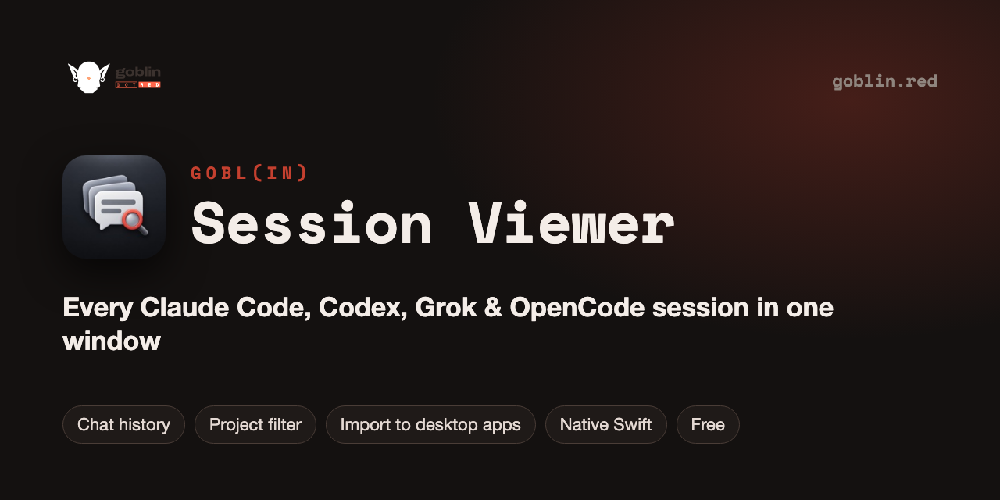

<p align="center"></p>

# GOBL(in) Session Viewer — Claude Code, Codex, Grok and OpenCode session history for macOS

   [](LICENSE) [](https://github.com/goblin-red/Session-Viewer/stargazers)

**Find any conversation you ever had with an AI coding agent.** One native macOS window lists every Claude Code, Codex, Grok and OpenCode session on your Mac — with the first message, project folder, size and date — and can import terminal sessions into the Claude and Codex desktop apps so you can continue them there.

Lets you view all the sessions of your terminal and desktop agents.

One window lists every conversation you had with Claude Code, Codex, Grok and OpenCode on this Mac:
the first message, the folder, where it was started, the size and the date. Click a title to read how the
conversation began. For Claude and Codex it can also put a terminal session into the history of the
desktop app, so you can continue it there.
One of the apps of [GOBL(in)](https://goblin.red).

## Features

- Four sources: Claude and Codex with import, Grok and OpenCode for viewing only.
- Filter by project, with the number of sessions in each one.
- For every session: the first message, the folder, where it was started (terminal, desktop app, SDK),
  the size, the date and the status.
- Click a session's title to see its first ten exchanges.
- Click a column header to sort the table.
- Automated runs (sessions started by scripts and other agents, subagents) are hidden by default;
  the "Automated runs" checkbox shows them.
- Sessions that are already in the desktop app are marked and can't be imported twice.
- The list loads 50 sessions at a time.

## Where the sessions come from

| Source | Where sessions are found | What import writes |
| --- | --- | --- |
| **Claude** | `~/.claude/projects/<project>/*.jsonl` | a small `local_<id>.json` card in `~/Library/Application Support/Claude/claude-code-sessions/…` |
| **Codex** | `~/.codex/sessions/**/rollout-*.jsonl` | a row in the `threads` table of `~/.codex/state_5.sqlite` |
| **Grok** | `~/.grok/sessions/<project>/<id>/` | nothing: view only |
| **OpenCode** | `~/.local/share/opencode/opencode.db` | nothing: view only |

Viewing only reads these files. Import does not copy or change the conversation itself: it adds a record
that tells the desktop app "this session exists, and here it is". After the import, quit the desktop app
(⌘Q) and open it again: the session appears in its history.

## Install

Paste this into Terminal:

```sh
curl -fsSL https://raw.githubusercontent.com/goblin-red/Session-Viewer/main/install.sh | bash
```

The script downloads the ready-made build from [Releases](https://github.com/goblin-red/Session-Viewer/releases/latest),
puts it into `/Applications` and opens it. The build is universal: it runs on Apple Silicon and on Intel Macs,
and no Xcode tools are needed. To update, run the same command again.

Downloaded the zip by hand? The app is not notarized by Apple, so macOS blocks a downloaded copy.
Unblock it once:

```sh
xattr -dr com.apple.quarantine "/path/to/GOBL(in) Session Viewer.app"
```

## Please note

The app reads the session files of the agents, and import writes to the internal storage of the Claude
desktop app and of Codex. These formats are not documented and may change with any update, so a source
or the import may stop working. It is a personal tool, use it at your own risk.

## Requirements

- macOS 10.15 or newer
- At least one of the agents: Claude Code, Codex, Grok, OpenCode

## Build from source

Needs Xcode Command Line Tools (`xcode-select --install`).

```sh
git clone https://github.com/goblin-red/Session-Viewer.git
cd Session-Viewer

./build_app.sh
open "build/GOBL(in) Session Viewer.app"
```

## Project

| Path | Purpose |
| --- | --- |
| `Sources/main.swift` | the app (AppKit, SQLite) |
| `build_app.sh` | builds the app (arm64 + x86_64) |
| `install.sh` | installs the ready-made build from Releases |
| `package.sh` | packs the build for Releases: `build/goblin-session-viewer-macos.zip` |
| `logo.svg`, `AppIcon.icns` | the Goblin logo for the window and the app icon |
| `CHANGELOG.md` | change history |

## FAQ

**Where does Claude Code store its sessions?**
In `~/.claude/projects/<project>/*.jsonl`, one file per conversation. Session Viewer reads them (read-only) and shows them as a sortable, filterable list.

**How do I continue a Claude Code terminal session in the Claude desktop app?**
Select the session and press Import: the app adds a small card that tells the desktop app the session exists. Restart the desktop app and the conversation appears in its history.

**Where is the Codex CLI history?**
In `~/.codex/sessions/**/rollout-*.jsonl`. Session Viewer lists those sessions too and can add them to the Codex desktop app.

## More GOBL(in) apps

Free and open source, from the makers of [GOBL(in)](https://goblin.red):

| App | What it does |
| --- | --- |
| [GOBL(in) Remote](https://github.com/goblin-red/Goblin-Remote) | self-hosted remote desktop for macOS in any browser, over cheap PHP hosting |
| [GOBL(in) Voice](https://github.com/goblin-red/Orca-Voice) | voice control and dictation for Claude Code, Codex and Orca on macOS |
| [GOBL(in) Drag & Taskbar](https://github.com/goblin-red/Drag-and-Taskbar) | move windows with trackpad gestures, a real taskbar and Alt-Tab for macOS |
| [GOBL(in) Convert](https://github.com/goblin-red/Photo-Convert) | fast batch JPEG converter and photo resizer for macOS |
| [GOBL(in) Workflow](https://github.com/goblin-red/Workflow) | visual flowchart workflows run by AI coding agents |

If this project is useful to you, please ⭐ star it — it helps other people find it.


## License

[MIT](LICENSE)
